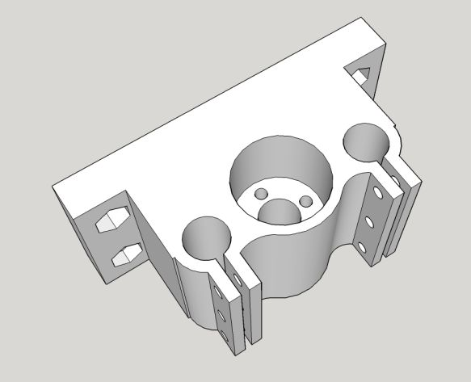

# Yet Another CNC Milling Machine

Some time ago I decided that I need a CNC milling machine that would mainly be able to etch and drill PCBs, so that I can prototype faster when building circuits. There were already available, cheap, and similar CNC machines for this purpose, however, most of them had weak spindles and slender frame members which are suitable only to machine PCB materials or acrylic, but I also wanted to machine some other materials as well. There were also some professional grade machines for this purpose, but they were either expensive and overqualified, or didn't meet the specs I required. And most importantly, as a machinery enthusiast I wanted to build one from scratch for fun. Here, I'll try to present my not-so-original design for such a machine.  

## Overall Design

The frame design is very much like those cheap Chinese routers such as [this one](https://www.banggood.com/CNC2418-3-Axis-Mini-DIY-CNC-Router-USB-Wood-Carving-Engraving-Machine-p-1239336.html?rmmds=search&cur_warehouse=CN). Most of the machines offered by Chinese vendors come with 775 or 755 model spindles which are rated in between 60W and 150W. I wanted the machine to be able to mill other materials like MDF, hard plastics (like PA, PE, POM, etc.), and low grade aluminum. Thus my first modification was to use a [stronger spindle of 400W](https://www.banggood.com/12-48V-400W-ER11-Air-Cooled-Engraver-Spindle-Motor-for-CNC-Carving-p-1269291.html?rmmds=search&cur_warehouse=CN). Additionally, these routers are mostly built with 20mm by 20mm aluminum Sigma profiles. Since I'll be using a stronger spindle and machining more rigid materials, I went with 30mm by 60mm and 30mm by 30mm sections mostly. Here is the overall view of the machine:  

This design offers 20cm by 20cm working area and 10cm of working depth.  

The system is mobilized by NEMA17 (specifically 42HS4401) stepper motors, which are driven by A4988 modules embedded into the combination of [an Arduino Uno and a CNC shield](http://osoyoo.com/2017/04/arduino-uno-cnc-shield-v3-0-a4988/). However, I didn't connect the spindle control to the Uno yet, but simply built a box that contains a switch to power it on/off (other switch is for the 3D printer) and adjust the speed manually. One important thing here is that I modified all axes for half steps. This is achieved by connecting some jumpers onto the CNC shield. The details are explained in the link above. The reason of half stepping is to get a better resolution as well as silencing the stepper motors. Half stepping torque of stepper motors is given as 75% of full stepping, so not much loss there. Quarter stepping will make it more silent and accurate, however the torque will decrease around 35% which is too much.  

There are already available 3D printed cases to hold both the Arduino Uno and mentioned shield, and I used [this one](https://www.thingiverse.com/thing:2808019). The case is put outside the enclosed box, since A4988 modules can get dangerously hot inside. I mounted an 8cm fan on top of this case for the same reason. And don't forget to attach tiny heat sinks on top of A4988 modules.  

And when all was finished, I realized that the machine makes too much noise to work at night in an apartment. So, I built an ugly-looking, but well-functioning box for sound isolation. It is simply a box with 60cm by 60cm OSB plates, connected with 60cm square wooden legs. Then 6 sides are enclosed by 6 Bondex plates (which is a laminated material with layers foam + rubber + foam as can be seen [here](https://www.adanasesizolasyonu.com/wp-content/uploads/2018/03/Bondex-S%C3%BCnger222.jpg)). I also coated Bondex plates with fabric (as if it's gonna look better) and flexible plastic sheets (so that I can collect the dirt after a milling operation easily). This worked well, except that the machine vibrates the surroundings, so that some noise is regenerated outside the box. What I did was to use some stiff foam as an isolator beneath the box which damped the vibration considerably. According to my phone measurements, the booth drops the noise by 30db, which is enough to keep my neighbors happy.  

And it looks like this in my workshop:  

## Bill of Materials

### Frame

2x 38cm long [sigma profiles with 30mm by 60mm sections](https://tr.aliexpress.com/item/3D-End-striyel-al-minyum-ala-m-Profil-3060-W-A-r-Al-minyum-3060-W/32987773308.html?spm=a2g10.search0104.3.2.64d9579258CQCO&transAbTest=ae803_4&ws_ab_test=searchweb0_0%2Csearchweb201602_8_10065_10068_319_10059_10884_317_10887_10696_321_322_10084_453_10083_454_10103_10618_10307_537_536%2Csearchweb201603_52%2CppcSwitch_0&algo_pvid=3b356489-477e-4ea6-9d64-cff1de807f66&algo_expid=3b356489-477e-4ea6-9d64-cff1de807f66-0)  
3x 25.5cm long [sigma profiles with 30mm by 30mm sections](https://tr.aliexpress.com/item/3D-Yaz-c-Par-alar-3030-Al-minyum-Profil-Avrupa-Standart-Eloksal-Lineer-Ray-Al-minyum/32968908166.html?spm=a2g10.search0104.3.1.db8e505fyDKoDK&transAbTest=ae803_4&ws_ab_test=searchweb0_0%2Csearchweb201602_8_10065_10068_319_10059_10884_317_10887_10696_321_322_10084_453_10083_454_10103_10618_10307_537_536%2Csearchweb201603_52%2CppcSwitch_0&algo_pvid=f979533b-bf45-4da0-9746-06bc9013834e&algo_expid=f979533b-bf45-4da0-9746-06bc9013834e-0)  
4x 8.5cm long sigma profiles with 30mm by 30mm sections  
2x 10cm long [sigma profiles with 20mm by 20mm sections](https://tr.aliexpress.com/item/CNC-3D-Printer-Parts-4pcs-lot-European-Standard-Anodized-V-Slot-Linear-Rail-Aluminum-Profile-Extrusion/32813616949.html?spm=a2g10.search0104.3.15.4f8e60de5m5ITu&ws_ab_test=searchweb0_0,searchweb201602_8_10065_10068_319_10059_10884_317_10887_10696_321_322_10084_453_10083_454_10103_10618_10307_537_536,searchweb201603_52,ppcSwitch_0&algo_expid=79a273b7-c577-4c55-8660-7f41bd6c1b0e-2&algo_pvid=79a273b7-c577-4c55-8660-7f41bd6c1b0e&transAbTest=ae803_4)  
4x 14cm long sigma profiles with 20mm by 20mm sections  
2x 24cm long [sigma profiles with 15mm by 120mm sections](http://www.sigmaprofil.net/15x120-sigma-profile)  
14x [corner connectors for 30mm sigmas](https://tr.aliexpress.com/item/10pcs-of-3030-Corner-Fitting-Angle-30x30-Decorative-Brackets-Aluminum-Profile-Accessories-L-Connector-Fasten-connector/32669590916.html?spm=a2g10.search0104.3.66.44c16d022rDs3I&ws_ab_test=searchweb0_0,searchweb201602_8_10065_10068_319_10059_10884_317_10887_10696_321_322_10084_453_10083_454_10103_10618_10307_537_536,searchweb201603_52,ppcSwitch_0&algo_expid=9d5dbc37-118d-4f2e-b263-79113ac94142-9&algo_pvid=9d5dbc37-118d-4f2e-b263-79113ac94142&transAbTest=ae803_4)  
4x [corner connectors for 20mm sigmas](https://tr.aliexpress.com/item/10-pcs-25-pcs-al-minyum-2020-k-e-parantez-tertibatlar-20x20x17mm-k-e-a-braketi/32922071230.html?spm=a2g10.search0104.3.51.44c16d022rDs3I&transAbTest=ae803_4&ws_ab_test=searchweb0_0%2Csearchweb201602_8_10065_10068_319_10059_10884_317_10887_10696_321_322_10084_453_10083_454_10103_10618_10307_537_536%2Csearchweb201603_52%2CppcSwitch_0&algo_pvid=9d5dbc37-118d-4f2e-b263-79113ac94142&algo_expid=9d5dbc37-118d-4f2e-b263-79113ac94142-7)  

### Rails

2x 18cm long [M8 linear shafts for Z axis](https://www.banggood.com/Outer-Diameter-8mm-x-300380400500mm-Cylinder-Liner-Rail-Linear-Shaft-Optical-Axis-p-993100.html?rmmds=search)  
4x 30cm long M8 linear shafts for XY axes  
1x 18cm long 1.25mm step M8 lead screw for Z axis  
2x 30cm long [8mm step M8 lead screw for XY axes](https://www.banggood.com/T8-8mm-1000mm-Stainless-Steel-Trapezoidal-Lead-Screw-For-3D-Printer-p-1146127.html?rmmds=search)  
12x [SK08 shaft supports](https://aliexpress.com/item/SK08-SK-STAND-UP-Shaft-Support/582520990.html)  
3x [KP08 bearing for lead screw ends](https://tr.banggood.com/8mm-Bore-Diameter-Pillow-Block-Mounted-Ball-Bearing-KP004-Zinc-Alloy-p-976258.html?cur_warehouse=CN)  
3x [5mm to 8mm flexible couplings for NEMA17](https://tr.aliexpress.com/item/5-adet-grup-3d-yaz-c-aksesuarlar-5x8mm-veya-5x5mm-z-eksen-Nema-17-23-Step/32840459829.html?spm=a2g10.search0104.3.8.3aa929f58Rln7v&transAbTest=ae803_4&ws_ab_test=searchweb0_0%2Csearchweb201602_8_10065_10068_319_10059_10884_317_10887_10696_321_322_10084_453_10083_454_10103_10618_10307_537_536%2Csearchweb201603_52%2CppcSwitch_0&algo_pvid=c4c736e0-9523-4ddc-843a-400816d356f1&algo_expid=c4c736e0-9523-4ddc-843a-400816d356f1-1)  
3x [M8 anti-backlash nuts for lead screws](https://tr.aliexpress.com/item/T8-Anti-Backlash-Spring-Loaded-Nut-Elimination-Gap-Nut-for-8mm-Acme-Threaded-Rod-Lead-Screws/32808521751.html?spm=a2g10.search0104.3.1.30cd6aebHwpYyA&ws_ab_test=searchweb0_0,searchweb201602_8_10065_10068_319_10059_10884_317_10887_10696_321_322_10084_453_10083_454_10103_10618_10307_537_536,searchweb201603_52,ppcSwitch_0&algo_expid=3690f36e-8d57-4c15-9ed8-b457cb2fba50-0&algo_pvid=3690f36e-8d57-4c15-9ed8-b457cb2fba50&transAbTest=ae803_4)
8x [LM8UU linear bearings](https://www.banggood.com/LM8UU-8mm-Linear-Ball-Bearing-Bush-Steel-for-CNC-Router-Mill-Machine-p-906777.html?rmmds=search&cur_warehouse=CN)  
4x [PTFE coated 8mm diameter, 15 mm long linear bearings](https://www.rulmanmarketi.com/urun/pap-0815-p10-teflon-burc-8x10x15-permaglide-burc-3459)  

### Nuts and Bolts

Lots of 10mm long M5 bolts  
Lots of M5 T-nuts for 3030 profile  
Lots of 8mm long M4 bolts  
Lots of M4 T-nuts for 2020 profile  

### Motors
3x NEMA17 stepper similar to [that](https://tr.banggood.com/JKM-42-Hybrid-Stepper-Motor-2-Phase-1_840MM-For-CNC-Router-p-933548.html?rmmds=detail-left-hotproducts__5&cur_warehouse=CN)  
2x [NEMA17 motor mounts](https://tr.aliexpress.com/item/NEMA-17-Steppr-Motor-Aksesuarlar-Braketi-Destek-Montaj-L-Tipi-Braketi-Da-42-Step-Motor-Stepping/32919542128.html?spm=a2g10.search0302.3.9.e18d7fc7Gr2oac&ws_ab_test=searchweb0_0%2Csearchweb201602_0_10084_10083_10887_10307_321_453_322_454_10618_536_10065_317_537_10068_319_10059_10103_10884_10696%2Csearchweb201603_0%2CppcSwitch_0&algo_pvid=5cbaa8ca-f896-4117-816e-3513711ace87&algo_expid=5cbaa8ca-f896-4117-816e-3513711ace87-1)  
1x [400W air cooled spindle motor, clamp, and PS](https://www.banggood.com/400W-12000rpm-ER11-Chuck-CNC-Brushless-Spindle-Motor-with-Driver-Speed-Controller-and-Clamp-p-1149321.html?rmmds=search)  

### Controller
1x [Arduino Uno](https://store.arduino.cc/usa/arduino-uno-rev3)  
1x [Arduino CNC Shield](https://tr.aliexpress.com/item/CNC-kit-for-arduino-CNC-Shield-V3/32829060574.html?spm=a2g10.search0302.3.1.565e3ec3sJvzKc&ws_ab_test=searchweb0_0,searchweb201602_0_10084_10083_10887_10307_321_453_322_454_10618_536_10065_317_537_10068_319_10059_10103_10884_10696,searchweb201603_0,ppcSwitch_0&algo_pvid=94aba3e1-d1bb-4407-9ae0-063b6d83051e&algo_expid=94aba3e1-d1bb-4407-9ae0-063b6d83051e-0)  
3x [A4988 driver modules](https://tr.aliexpress.com/item/Aokin-A4988-S-r-c-Mod-l-i-in-So-utucu-ile-Step-Motor-S-r/32951539408.html?spm=a2g10.search0104.3.8.51c867a2WtuPfl&transAbTest=ae803_4&ws_ab_test=searchweb0_0%2Csearchweb201602_8_10065_10068_319_10059_10884_317_10887_10696_321_322_10084_453_10083_454_10103_10618_10307_537_536%2Csearchweb201603_52%2CppcSwitch_0&algo_pvid=35ca1d16-b03f-4dbc-aae9-9204227c1e39&algo_expid=35ca1d16-b03f-4dbc-aae9-9204227c1e39-4)  
1x [12V 100W PS for controller and the stepper motors](https://www.banggood.com/AC-220V-To-DC-12V-10A-120W-Power-Supply-Lighting-Transformer-Adapter-Driver-For-Strip-Light-Lamp-p-1145387.html?rmmds=buy&cur_warehouse=CN)  

## Custom Parts

You need to 3D print the parts in the `printedParts` directory. These parts are dimensioned to fit the other parts like SK08, KP08, L8UU, etc.  

Moving part in Z axis: This part connects the lead screw nut and PTFE coated bearings to the spindle clamp.  

This part connects LM8UU bearings to the sigma profiles they need to connect to. You should print 8 of these.  

## Assembly

I wish that I can shoot a video that shows the assembly. But it'll be very similar to [this](https://www.youtube.com/watch?v=hB4Cvbtu-lA) or [that](https://www.youtube.com/watch?v=P-zZxicjNww). I'm not sure, maybe some day.  

## Installing Software and Suggested Settings to Operate the Machine

Arduino Uno hosts [GRBL software](https://github.com/grbl/grbl) which routes the machine. To operate the machine from my computer, I use [bCNC](https://github.com/vlachoudis/bCNC), since it's not a gcode sender only, but does offer nice features like probing, autoleveling, gcode editing within a functional user interface.  

The settings I use when I am machining PCB materials is as such:  

Etching feed rates: XY = 250mm/min, Z = 100mm/min  
Z-down when etching: -0.15mm for 30 degree V-bit  

Drill feed rates: Z = 100mm/min  
Drill depth: -1.8mm (or PCB thickness - 0.3mm)

Milling feed rates: XY = 150mm/min, Z = 100mm/min  
Milling depth: -1.5mm (if only perimeter will be milled)  
Milling depth: -0.5mm (if an inner path will be milled)  

## Pictures

Close-up to the spindle.  

The clamps I machined out of MDF for PCBs. These clamps have a 3mm cavity to press two PCBs. Why two PCBs? Well, if we use a single PCB put directly above the table and we set the drill depth to 1.5mm, the holes will barely be complete. It's a good practice to drill a bit more than needed to get clean holes. However, if we drill more, the aluminum table will be full of holes soon; and the drill bits may get damages since they are delicate. So, I put a PCB onto another PCB with the same size (the thickness becomes 3mm, thus the cavity in the clamp), and drill down to 1.8mm. So I have collection of dummy PCBs for some common sizes (like 5cm by 10cm, 10cm by 10cm, etc.).  

X rail left and right connections.  

Y rail close-up and stepper motor.  

Z axis left and right view.  